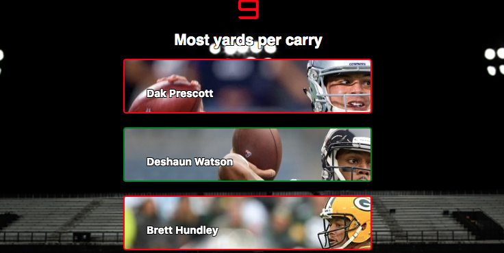
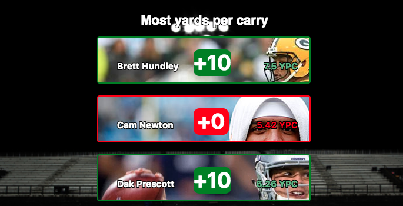
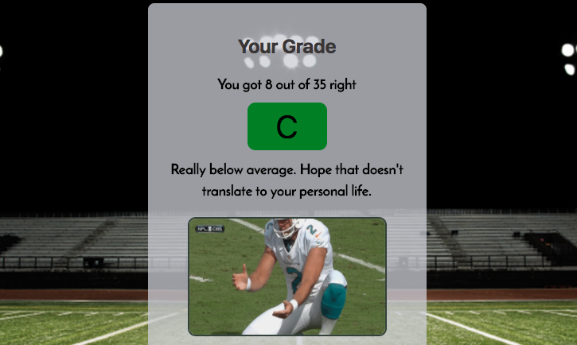

# Fantasy Football Ranker 2017

## Summary

Time to test your Football stats and Fantasy Football obsession. This ridiculously challenging App is now live at [FFR2017](http://sharp-nightingale-21d173.netlify.com/) .

### To get started, select your difficulty:

* Easy sets a green border when the player is in the correct rank.
* Hard, well you're on your own.

### Select the position you think you know best.

### Once the game starts, you will have 16 seconds to rearrange players based on the question.

### When the timer runs out, you are given 10 points for every correct placement

A +10 will show up for every correct rank and also each players stats will be shown.

### Finally, once all questions have been completed, you will be given a grade

Just be ready for some brutal honesty.

## Tech Used

* React
* Redux
* React Motion
* Styled Components
* JavaScript
* HTML
* CSS
